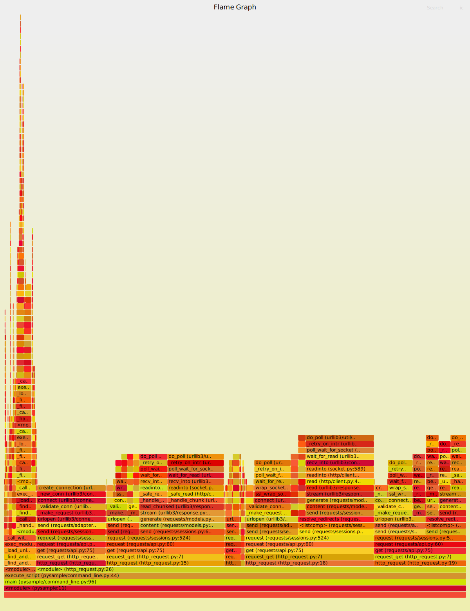
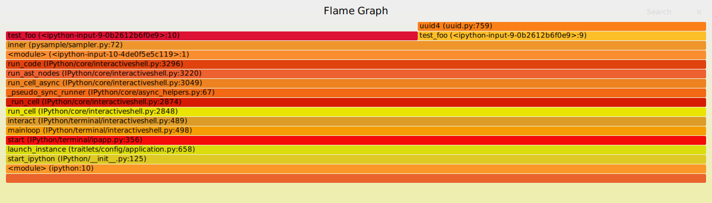

PySample: Sampling profiler for Python programs.
======

PySample是一个python高性能性能分析工具，通过定时收集python解释器的堆栈信息，并生成
[火焰图](https://github.com/brendangregg/FlameGraph)，
从而帮助用户能够快速发现程序的性能瓶颈。pysample既可以作为python库集成到其他python应用，
也能作为python程序启动器直接使用(作为程序启动器使用时无需修改源码)。
PySample核心代码使用c语言实现，确保它能够在各个场景下都能高效的运行。
相比较于[py-spy](https://github.com/benfred/py-spy)，
PySample能够更好地与业务场景结合；例如：结合flask/django等web框架分析单个请求的性能。

## Installation
通过pypi安装：
```shell
pip install pysample-profiler  # 找不到安装包可以尝试下面一条命令
pip install pysample-profiler --index-url https://pypi.org/project 
```


## Quickstart

下载[FlameGraph](https://github.com/brendangregg/FlameGraph)


### 分析整个程序的运行性能(无需修改源码)

```shell
pysample -p /root/FlameGraph/flamegraph.pl -o /tmp/http_request.svg  tests/scripts/http_request.py
```
执行上述命令后将会生成如下火焰图文件(.svg)：


<b>注：火焰图中的每一个sample表示1ms</b>


### 分析程序中某个函数的执行性能
在ipython中运行如下命令：
```python
from pysample.sampler import sample

@sample(100, output_path="/tmp/test_foo.txt")
def test_foo():
    import time
    import uuid
    for i in range(0, 100):
        for _ in range(0, 1000):
            uuid.uuid4()
        time.sleep(0.01)

test_foo()
```
执行完成后，函数test_foo的采样结果保存在/tmp/test_foo.txt文件中，然后将采样结果转成火焰图.

```shell
/root/FlameGraph/flamegraph.pl /tmp/test_foo.txt > /tmp/test_foo.svg
```

生成的火焰图效果如下：



### 监控web服务中慢请求的执行情况
安装web服务相关依赖
```shell
pip install -r requirements_web.txt
```

启动PySample server
```shell
cd server
export DATABASE_URI=mysql+pymysql://{user}:{password}@{host}/{database}?charset=utf8mb4
export FLAMEGRAPH_PATH=/root/FlameGraph/flamegraph.pl
python app.py -i   # init db tables
python app.py --host=127.0.0.1 --port=10002
```

构建待测试的web服务(app.py)，示例代码如下：
```python
from pysample.contrib.flask import FlaskSample
from flask import Flask
import logging

logging.basicConfig(level=logging.DEBUG)

app = Flask(__name__)

fsample = FlaskSample(
    url="http://127.0.0.1:10002/test_project",  # PySample server url and project name
    output_threshold=100,                       # The output threshold is 100 ms
)
fsample.init_app(app)

@app.route('/slow_request')
def slow_request():
    import time
    time.sleep(1)
    return 'sleep 1 second.'

if __name__ == '__main__':
    app.run(host="127.0.0.1", port=10001)
```

查看慢请求的火焰图:


另外，还可以根据X-PySample-ID直接访问url '/sample/flamegraph/<project>/<sample_id>'来查看火焰图.
